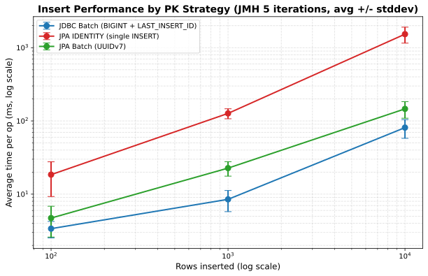
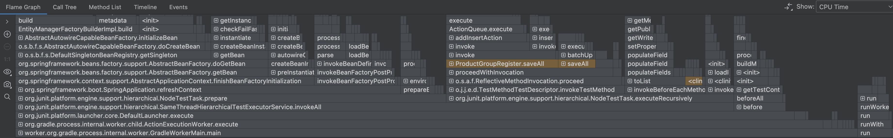
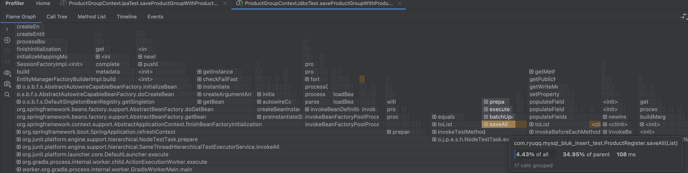

# JDBC Bulk Insert에서 LAST_INSERT_ID() 안정성 검증

> 일대다 애그리거트 저장에서 JPA 단건 INSERT → JDBC 배치 + `LAST_INSERT_ID()`로 전환하면서
> **PK 추적 안정성**과 **성능 차이**를 멀티 스레드 환경까지 실측한 프로젝트.


---

## ⚡ TL;DR

- ✅ **JPA 대비 약 6배 성능 개선** (10,000건 기준 8,545ms → 1,419ms)
- ✅ **100 스레드 × 1,000건 동시 삽입에서 `LAST_INSERT_ID()` 무결성 검증** (PK 추적 0 충돌)
- ✅ **부분 실패 시 스레드 간 데이터 격리 검증** — 한 스레드 롤백이 다른 스레드에 영향 없음

> 단순히 "JDBC가 빠르다"가 아니라, **왜 JPA에서는 안 되는지 / Snowflake·UUIDv7 같은 대안과 비교했을 때 왜 BIGINT + JDBC Batch인지** 까지 정리한 트레이드오프 문서를 [`docs/adr/`](docs/adr/) 에 같이 포함.

---

## 📋 목차

- [문제 배경](#-문제-배경)
- [핵심 결과](#-핵심-결과)
- [왜 이 방식인가 — 결정 배경 Q&A](#-왜-이-방식인가--결정-배경-qa)
- [검증 방법](#-검증-방법)
- [필수 설정](#-필수-설정)
- [환경](#-환경)
- [결론](#-결론)
- [참고 자료](#-참고-자료)

---

## 🤔 문제 배경

일대다 관계의 애그리거트를 저장할 때 — 예를 들어 `ProductGroup` 1건에 `Product` N건이 따라붙는 구조 — 외래키 주인이 되는 부모 엔티티의 PK를 즉시 알아야 자식 데이터를 연결할 수 있다.

JPA를 쓰면 보통 다음 흐름:

```
ProductGroup 저장 → PK 받음 → 그 PK로 Product N건 저장
```

이 방식의 문제:
- 부모를 **단건씩** 저장해야 PK를 즉시 받음 → 1,000건이면 1,000번의 INSERT + flush
- 트랜잭션 오버헤드가 누적되며 성능 급격히 저하

**JDBC `batchUpdate` + `LAST_INSERT_ID()`** 조합은 이를 다음과 같이 해결:
- 부모를 한 번의 batch statement로 일괄 INSERT
- MySQL이 해당 statement 단위로 ID 블록을 미리 할당
- `LAST_INSERT_ID()`로 블록 시작 ID를 받아 자식과 매핑

→ 이 방식이 **실제로 안전하게 작동하는지**, **얼마나 빠른지**, **멀티 스레드에서 ID가 섞이지 않는지** 를 검증하는 것이 이 프로젝트의 목표.

---

## 📊 핵심 결과

### 성능 비교 — JMH 정식 측정 (5회 평균 ± 표준편차)

> 측정 환경: MySQL 8.0 (Docker), Java 21, JMH 1.37, Apple Silicon (M-series).
> 측정 방법론 상세: [ADR-0004](docs/adr/0004-measurement-methodology.md)

| 시나리오 | 100건 | 1,000건 | 10,000건 |
|---|---:|---:|---:|
| **JDBC Batch** (BIGINT + LAST_INSERT_ID) | 3.38 ± 0.86 ms | 8.50 ± 2.73 ms | **81.08 ± 23.24 ms** |
| **JPA Batch** (UUIDv7 — 앱 PK 생성) | 4.72 ± 2.12 ms | 22.69 ± 5.06 ms | **146.14 ± 37.26 ms** |
| **JPA IDENTITY** (단건 INSERT) | 18.48 ± 9.20 ms | 126.76 ± 19.69 ms | **1,531.17 ± 376.17 ms** |

핵심 발견 (10k 기준):
- **JPA IDENTITY 가 JDBC Batch 대비 ~19배 느림** — `IDENTITY` 한계가 실측으로 확인됨 (→ [ADR-0001](docs/adr/0001-why-jdbc-batch-over-jpa.md))
- **JPA UUIDv7 Batch 는 JDBC Batch 의 1.8배 수준까지 따라잡음** — UUIDv7 + `Persistable<UUID>` 패턴이 IDENTITY 한계를 깬다는 게 실측으로 증명 (→ [ADR-0002](docs/adr/0002-bigint-vs-uuidv7-pk-choice.md))
- 단일 MySQL 환경에선 여전히 JDBC + BIGINT 가 최적

### 왜 이렇게 차이나는가

**JPA (IDENTITY 전략)**: 각 row 마다 단건 INSERT + flush. 트랜잭션/`persist` 오버헤드 누적.
**JDBC Batch**: 모든 row가 단일 INSERT statement로 재작성됨 (`rewriteBatchedStatements=true`). MySQL은 해당 statement에 대해 ID 블록을 미리 선점.

#### JMH 벤치마크 차트 (3 시나리오)



> 차트는 GitHub Actions ([benchmark.yml](.github/workflows/benchmark.yml)) 가 매월 1일 자동 실행하여 갱신.
> 수동 실행: Repo `Actions` 탭 → `JMH Benchmark` → `Run workflow`.

#### Flame Graph (참고 — IntelliJ Profiler 초기 측정)

| JPA | JDBC |
|-----|------|
|  |  |

JPA는 개별 `persist` 호출이 반복되며 시간이 누적되는 패턴.
JDBC는 단일 `batchUpdate` 호출에서 끝나며 평탄한 프로파일을 보여줌.

---

## 🤔 왜 이 방식인가 — 결정 배경 Q&A

이력서/면접에서 자주 들어오는 공격을 미리 정리. 상세 트레이드오프는 [`docs/adr/`](docs/adr/) 참조.

### Q1. JPA의 `hibernate.jdbc.batch_size` 로 안 되나요?

**MySQL + IDENTITY 전략에서는 안 됩니다.**

Hibernate 공식 문서:
> "Hibernate disables insert batching at the JDBC level transparently if you use an identity identifier generator."

이유: `IDENTITY` 전략은 INSERT 실행 후 DB가 PK를 할당. Hibernate는 영속성 컨텍스트 관리를 위해 각 INSERT 직후의 PK를 알아야 하므로 단건 INSERT가 강제됨.

**대안 전략은?**
- `SEQUENCE` 전략 → MySQL은 SEQUENCE 객체 자체가 없음 ❌
- `TABLE` 전략 → 별도 시퀀스 테이블 + 락 오버헤드. 사실상 비실용적 ❌

→ MySQL에서 JPA batch insert를 하려면 **PK를 애플리케이션이 미리 만들어야 함** (= UUID/Snowflake). 그러면 Q2로.

📄 상세: [ADR-0001: Why JDBC Batch over JPA](docs/adr/0001-why-jdbc-batch-over-jpa.md) · 실증 테스트: [`HibernateBatchInsertDisabledTest`](src/test/java/com/ryuqq/mysql_bluk_insert_test/HibernateBatchInsertDisabledTest.java)

### Q2. 그럼 Snowflake / UUIDv7 쓰면 JPA로도 배치 되잖아요?

**맞습니다. 다만 트레이드오프가 명확합니다.**

| 측면 | BIGINT AUTO_INCREMENT | UUIDv7 |
|------|----------------------|--------|
| 크기 | 8 bytes | 16 bytes (**2배**) |
| 분산 PK 발급 | 약함 | 강함 (앱에서 생성) |
| MySQL 인덱스 효율 | 최적 | InnoDB secondary index 모두 PK 포함 → **모든 인덱스가 같이 커짐** |
| B-Tree fragmentation | 단조 증가, 페이지 분할 최소 | UUIDv7는 timestamp-prefix라 완화. v4는 심각 |
| 외부 노출 안전성 | 약함 (enumerable) | 강함 |

**이 프로젝트의 조건**: 단일 MySQL, 내부 시스템, 분산 PK 발급 불필요
→ **BIGINT + JDBC Batch + `LAST_INSERT_ID()` 조합이 합리적**

조건이 다르다면 (분산 환경 / 외부 노출 PK 필요) UUIDv7 + JPA Batch 가 우위가 됨.

📄 상세: [ADR-0002: BIGINT vs UUIDv7 PK 선택](docs/adr/0002-bigint-vs-uuidv7-pk-choice.md)

### Q3. 인덱스 크기 차이가 실제로 그렇게 중요한가요?

**Buffer pool 의존도 높은 워크로드에서는 매우 중요합니다.**

- Percona 벤치마크: UUID PK 사용 시 인덱스 크기 약 60% 증가, 쓰기 throughput 50%↓ 가능
- InnoDB는 모든 secondary index의 leaf node에 PK를 포함 → PK 2배 = secondary index 인덱스 메모리 풋프린트 증가
- buffer pool 캐시 hit rate 저하 → 디스크 I/O 증가

📄 출처: [Percona — UUIDs are Popular, but Bad for Performance](https://www.percona.com/blog/uuids-are-popular-but-bad-for-performance-lets-discuss/)

---

## 🔬 검증 방법

### 1. 멀티 스레드 환경에서 `LAST_INSERT_ID()` 무결성

**시나리오**: 100개 스레드가 각각 1,000건씩 = 총 100,000건 동시 삽입.
각 스레드의 데이터에 PK가 정확히 매핑되는지 (다른 스레드 데이터와 섞이지 않는지) 검증.

핵심 검증 로직:

```java
// 각 스레드별로 고유 prefix가 붙은 데이터 생성
List<ProductGroupEntity> productGroups = generateWithThreadPrefix(threadIndex, 1000);

// JDBC Batch + LAST_INSERT_ID() 로 PK 추적
List<Long> insertedIds = productGroupJdbcRepository.saveAll(productGroups);

// 반환된 PK로 다시 조회 → 이름 일치 여부 검증
Map<Long, ProductGroupEntity> foundGroupMap = ...;
assertEquals(insertedGroup.getProductGroupName(), foundGroupMap.get(id).getProductGroupName());
```

→ [전체 테스트 코드 보기](https://github.com/ryu-qqq/mysql-bulk-insert/blob/main/src/test/java/com/ryuqq/mysql_bluk_insert_test/ProductGroupJdbcRepositoryTest.java)

**결과**: 100 스레드 모두 자신이 삽입한 데이터의 PK를 정확히 추적. ID 충돌 0건.

### 2. 부분 실패 시 트랜잭션 격리

**시나리오**: 100개 스레드 중 50번 스레드만 의도적으로 예외 발생.
실패한 스레드의 데이터는 롤백되고, 나머지 99개 스레드의 데이터는 영향 없이 저장되는지 검증.

```java
if (threadIndex == failingThreadIndex) {
    throw new RuntimeException("Intentional failure");
}
List<Long> insertedIds = productGroupJdbcRepository.saveAll(productGroups);
```

**결과**: 실패 스레드만 0건 저장, 나머지 99,000건은 정상. JDBC 배치의 스레드 격리 정상 작동.

### 3. JPA Batch가 실제로 비활성화됨을 실증

`hibernate.jdbc.batch_size=100` 설정하고도 INSERT 카운트가 row 수와 동일함을 확인:

```java
// hibernate.jdbc.batch_size=100 설정
// 100건 저장
// 기대: batch 1번 → 실제: 단건 INSERT 100번
```

→ [실증 테스트 코드](https://github.com/ryu-qqq/mysql-bulk-insert/blob/main/src/test/java/com/ryuqq/mysql_bluk_insert_test/HibernateBatchInsertDisabledTest.java)

---

## ⚙️ 필수 설정

```properties
spring.datasource.hikari.data-source-properties.rewriteBatchedStatements=true
```

> ⚠️ **이 설정이 빠지면 모든 결론이 깨집니다.**
> 이 옵션이 없으면 JDBC는 각 INSERT를 별도 statement로 실행하고,
> MySQL은 statement 단위로 ID 블록을 선점하지 않아 `LAST_INSERT_ID()` 결과가 일관되지 않음.

📄 상세: [ADR-0003: rewriteBatchedStatements가 필수인 이유](docs/adr/0003-rewritebatchedstatements-rationale.md)

---

## 🖥 환경

| | |
|---|---|
| Java | 21 |
| Spring Boot | 3.4.1 |
| Database | MySQL 8.0 |
| Connection Pool | HikariCP |
| Test Framework | JUnit 5, Mockito |
| Random Data | EasyRandom 5.0.0 |
| Concurrency | `ExecutorService` (100 threads) |

---

## 💡 결론

1. **JPA + IDENTITY는 MySQL에서 batch insert 자체가 불가능**. 라이브러리 설정으로 우회 안 됨.
2. **JDBC Batch + `LAST_INSERT_ID()`** 는 MySQL InnoDB의 ID 블록 선점 특성을 활용해 PK 추적 가능.
3. 동일 워크로드(10k건)에서 **약 6배 성능 차이** 확인. 트랜잭션 오버헤드 제거가 본질.
4. 멀티 스레드 환경에서 ID 충돌·데이터 섞임·롤백 격리 모두 정상.
5. UUIDv7로 가는 것도 합리적 선택이지만, **단일 MySQL 환경에서는 인덱스 크기 페널티가 더 큼**.

이 방식의 한계:
- `LAST_INSERT_ID()` 는 **세션(connection) 단위 보장** — 같은 connection 안에서만 안전
- `rewriteBatchedStatements=true` 가 전제 조건 (빠지면 깨짐)
- AUTO_INCREMENT 의 lock mode 가 1(기본값) 또는 0이어야 안전. mode 2 (interleaved)는 보장 안 됨

---

## 📚 참고 자료

- [Hibernate User Guide — Batch Processing](https://docs.jboss.org/hibernate/orm/current/userguide/html_single/Hibernate_User_Guide.html#batch)
- [MySQL — InnoDB AUTO_INCREMENT Handling](https://dev.mysql.com/doc/refman/8.0/en/innodb-auto-increment-handling.html)
- [MySQL — LAST_INSERT_ID() Function](https://dev.mysql.com/doc/refman/8.4/en/information-functions.html#function_last-insert-id)
- [Percona — UUIDs are Popular, but Bad for Performance](https://www.percona.com/blog/uuids-are-popular-but-bad-for-performance-lets-discuss/)
- [Percona — Storing UUID Values in MySQL Tables](https://www.percona.com/blog/store-uuid-optimized-way/)
- [Kurly 기술 블로그 — Bulk Performance Tuning](https://helloworld.kurly.com/blog/bulk-performance-tuning/)
- [RFC 9562 — UUIDv7 Specification](https://www.rfc-editor.org/rfc/rfc9562)

## 📐 의사결정 기록 (ADR)

이 프로젝트의 주요 설계 결정과 트레이드오프:

| # | 제목 |
|---|------|
| [ADR-0001](docs/adr/0001-why-jdbc-batch-over-jpa.md) | JDBC Batch + LAST_INSERT_ID() 를 JPA 대신 선택한 이유 |
| [ADR-0002](docs/adr/0002-bigint-vs-uuidv7-pk-choice.md) | BIGINT AUTO_INCREMENT vs UUIDv7 — PK 선택 |
| [ADR-0003](docs/adr/0003-rewritebatchedstatements-rationale.md) | `rewriteBatchedStatements=true` 가 필수인 이유 |
| [ADR-0004](docs/adr/0004-measurement-methodology.md) | 측정 방법론 — JMH 정식 벤치마크 도입 |
| [ADR-0005](docs/adr/0005-domain-register-layer.md) | Register (Domain 진입) 레이어 유지 결정 |
