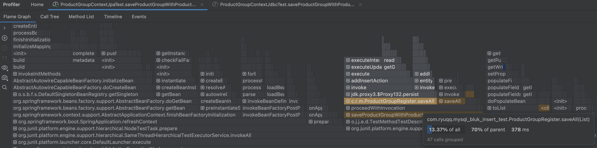

# MySQL Bulk Insert Test Project

## 프로젝트 개요

이 프로젝트는 MySQL에서 **`LAST_INSERT_ID()`**를 사용하여 **JDBC**로 대량의 데이터를 삽입하고, 삽입된 데이터의 **Primary Key(PK)**를 정확히 확인할 수 있는지 검증하기 위해 개발되었습니다. 또한, **멀티 스레드 환경**에서 `LAST_INSERT_ID()`가 스레드별로 고유하게 작동하는지 확인합니다.

### 문제 배경
기존에 연관된 데이터를 저장할 때, 일대다 관계의 애그리거트를 처리하는 경우, 외래키의 주인이 되는 엔티티들을 JDBC의 벌크 인서트로 삽입할 경우 생성된 PK를 즉시 확인하기 어렵습니다.
이를 해결하기 위해 JPA를 사용하여 단건 삽입 방식으로 각각의 PK를 확인한 후 연관 데이터를 저장하는 방식이 일반적이었습니다.
그러나 이러한 방식은 성능 저하를 초래하며, 대량 데이터를 보다 효율적으로 저장하기 위해 **JDBC의 batchInsert**와 **LAST_INSERT_ID()**를 활용하는 방법을 고려하게 되었습니다.

### 실험 목적
JDBC와 JPA의 성능 비교: 일대다 관계에서 각각의 방식이 실제 운영 환경에서 어떤 성능 차이를 보이는지 측정.
멀티 스레드 환경에서 LAST_INSERT_ID()의 안정성 검증: 각 스레드가 삽입한 데이터의 PK를 정확히 추적하는지 확인.


- 참고한 자료:
  - [Kurly 기술 블로그 - Bulk Insert](https://helloworld.kurly.com/blog/bulk-performance-tuning/#애플리케이션의-간단한-연산을-이용하면-insert된-모든-row의-pk를-알-수-있습니다.)
  - [MySQL 공식 문서 - LAST_INSERT_ID()](https://dev.mysql.com/doc/refman/8.4/en/information-functions.html#function_last-insert-id)
  - [MySQL 공식 문서 - AUTO_INCREMENT Handling in InnoDB](https://dev.mysql.com/doc/refman/8.4/en/innodb-auto-increment-handling.html)

---


## 프로젝트 결과
### ✅ 이 결과가 가능한 이유

MySQL InnoDB에서 AUTO_INCREMENT는 내부적으로 다음과 같은 방식으로 작동한다:

- `AUTO_INCREMENT`는 **INSERT 문 단위로 ID 블럭을 한꺼번에 선점**한다.
- `innodb_autoinc_lock_mode = 1` (기본값)에서는, 다중 row를 한 번에 삽입하는 statement에 대해 **ID 범위를 미리 할당**하고, 이후에 해당 범위 내에서 row들이 실제 삽입된다.
- `LAST_INSERT_ID()`는 해당 INSERT 문에서 할당된 **첫 번째 ID**를 반환한다.
- 이 ID는 **세션 단위로 보장**되며, 같은 connection 내에서 안전하게 사용할 수 있다.

---

### 🧠 정리

- JDBC Batch를 통해 여러 INSERT 문을 수행하더라도, `rewriteBatchedStatements=true` 설정을 통해 각 배치가 **하나의 INSERT statement로 재작성**된다면, MySQL은 **해당 statement 전체에 대해 ID 블럭을 미리 선점**한다.
- 이로 인해 각 배치 실행 후 `LAST_INSERT_ID()`는 **해당 블럭의 첫 번째 ID를 안정적으로 반환**하며, **ID 충돌이나 비순차적 현상 없이 일관된 결과**를 보장할 수 있다.

---

### ✅ 참고 설정

```properties
spring.datasource.hikari.data-source-properties.rewriteBatchedStatements=true
```
해당 설정이 없으면 JDBC가 각 INSERT를 별도 statement로 실행하므로, LAST_INSERT_ID 결과가 일관되지 않을 수 있다.


## 프로젝트 구조

### 엔티티

#### `ProductGroupEntity`
- 상품 그룹 데이터를 관리하는 엔티티로, PK는 `AUTO_INCREMENT`로 설정되어 있습니다.

#### `ProductEntity`
- 개별 상품 데이터를 관리하는 엔티티로, ProductGroupEntity와 다대일 연관 관계를 가집니다.

### 주요 컴포넌트

1. **JDBC Repository**
  - `ProductGroupJdbcRepository`와 `ProductJdbcRepository`는 대량 데이터를 `batchUpdate`를 사용해 삽입합니다.
  - `ProductGroupJdbcRepository`에서 `batchUpdate` 수행 후 **`LAST_INSERT_ID()`**를 활용해 삽입된 PK를 추적합니다.

2. **JPA Repository**
  - 기존 JPA 방식으로 데이터를 저장하고 PK를 반환합니다.
  - JPA는 `ProductGroupEntity`를 저장하며, `ProductEntity`는 JDBC로 처리합니다.
  - JDBC와의 혼합 사용을 통해 성능 비교를 위한 기반을 제공합니다.

3. **Service Layer**
  - `ProductGroupContextRegister`: `ProductGroupEntity`와 `ProductEntity`를 연관지어 저장합니다.

4. **Test Configuration**
  - `JdbcTestConfig`: 테스트 환경에서 JDBC 기반 레포지토리를 사용할 수 있도록 설정합니다.
  - `JpaTestConfig`: 테스트 환경에서 JPA 기반 레포지토리를 사용할 수 있도록 설정합니다.

---

## 주요 작업 및 검증

### 1. `LAST_INSERT_ID()` 검증

#### 검증 목표
- **멀티 스레드 환경**에서 `LAST_INSERT_ID()`가 각 스레드에서 고유하게 동작하는지 확인.

#### 작업 내용
- `ProductGroupJdbcRepository`에서 `batchUpdate`와 `LAST_INSERT_ID()`를 결합하여 삽입된 PK를 추적.
- 각 스레드에서 삽입된 데이터와 반환된 PK가 일치하는지 확인.

#### 멀티 스레드 검증 테스트 코드

```java
@Test
    void testConcurrentInserts() throws InterruptedException {
        int threadCount = 100; // 스레드 수
        int groupsPerThread = 1000; // 각 스레드가 삽입할 그룹 개수

        // 스레드 풀 생성
        ExecutorService executorService = Executors.newFixedThreadPool(threadCount);

        // 결과 저장 리스트
        List<Future<List<ProductGroupEntity>>> futureResults = new ArrayList<>();

        // 각 스레드에서 실행할 작업 정의
        IntStream.range(0, threadCount).forEach(threadIndex -> {
            Future<List<ProductGroupEntity>> future = executorService.submit(() -> {
                // 고유 데이터 생성 (스레드별 구분을 위해 이름에 스레드 ID 포함)
                List<ProductGroupEntity> productGroups = EasyRandomUtils.getInstance()
                        .objects(ProductGroupEntity.class, groupsPerThread)
                        .peek(group -> group.setProductGroupName("Thread-" + threadIndex + "-" + group.getProductGroupName()))
                        .toList();

                // 저장
                List<Long> insertedIds = productGroupJdbcRepository.saveAll(productGroups);

                // 저장된 ID를 엔티티에 매핑
                for (int i = 0; i < productGroups.size(); i++) {
                    productGroups.get(i).setId(insertedIds.get(i));
                }

                return productGroups;
            });
            futureResults.add(future);
        });

        // 모든 스레드가 완료될 때까지 대기
        executorService.shutdown();
        executorService.awaitTermination(1, TimeUnit.MINUTES);

        // 각 스레드의 결과 검증
        for (int threadIndex = 0; threadIndex < futureResults.size(); threadIndex++) {
            try {
                List<ProductGroupEntity> insertedGroups = futureResults.get(threadIndex).get();

                // 삽입된 상품명 리스트 생성
                List<String> insertedNames = insertedGroups.stream()
                        .map(ProductGroupEntity::getProductGroupName)
                        .toList();

                // 상품명으로 조회
                List<ProductGroupEntity> foundGroups = productGroupJdbcRepository.findByProductGroupNames(insertedNames);

                // ID로 매핑
                Map<Long, ProductGroupEntity> insertedGroupMap = insertedGroups.stream()
                        .collect(Collectors.toMap(ProductGroupEntity::getId, Function.identity()));

                Map<Long, ProductGroupEntity> foundGroupMap = foundGroups.stream()
                        .collect(Collectors.toMap(ProductGroupEntity::getId, Function.identity()));

                // ID와 이름 검증
                insertedGroupMap.forEach((id, insertedGroup) -> {
                    ProductGroupEntity foundGroup = foundGroupMap.get(id);
                    assertNotNull(foundGroup, "ID " + id + "로 조회된 상품 그룹이 없습니다.");
                    assertEquals(insertedGroup.getProductGroupName(), foundGroup.getProductGroupName(),
                            "ID " + id + "의 상품 그룹 이름이 일치하지 않습니다.");
                });

                System.out.println("Thread " + threadIndex + " passed verification.");
            } catch (ExecutionException e) {
                e.printStackTrace();
            }
        }
    }
```

### 2. 성능 테스트 결과

#### JDBC와 JPA 성능 비교

**테스트 조건:**
- 상품 그룹: 1,000개, 상품: 10,000개
- JPA와 JDBC 각각 성능 측정

#### 결과 요약

| **방식** | **총 실행 시간(ms)** | **평균 삽입 시간(ms)** |
|----------|-----------------|------------------|
| **JPA**  | 1240ms          | 1.24ms           |
| **JDBC** | 958ms           | 0.96ms           |


#### 프로파일러 분석
- 아래는 **JDBC**와 **JPA**의 성능 차이를 보여주는 **프로파일러 결과**입니다.

##### JDBC
- batchInsert 작업이 효율적으로 작동하며, 데이터베이스 작업이 주요 병목 지점임을 확인했습니다.
  프로파일러 결과에 따르면, batchUpdate 메서드에서 모든 데이터가 한 번에 삽입되며, 추가적인 로직 처리 시간이 최소화되었습니다.
  데이터 삽입 과정에서의 병목은 주로 데이터베이스 I/O 작업에서 발생하지만, JPA 대비 상당히 효율적임을 확인할 수 있었습니다.
##### JPA
- save 메서드에서 다수의 insert 작업이 개별적으로 실행되며, 트랜잭션 오버헤드가 주요 병목 지점으로 작용했습니다.
각 단건 작업이 독립적으로 처리되면서, JDBC의 batchInsert 방식에 비해 비효율적임을 확인할 수 있었습니다.
플레임 그래프에서 트랜잭션 관리 및 개별 persist 호출로 인해 작업 시간이 길어지는 양상이 드러났습니다.


##### 플레임 그래프 비교
- **JDBC**
batchUpdate 메서드 호출로 모든 데이터가 한 번에 삽입되는 구조를 확인.
데이터베이스 작업이 주요 병목이지만, JPA 대비 간소화된 작업 흐름을 보여줌.

- **JPA**
개별적으로 처리되는 persist 호출이 반복되며, 각각의 트랜잭션 오버헤드가 병목으로 나타남.
saveAll 메서드 내에서 발생하는 단일 작업의 누적 시간이 JDBC 대비 높은 것으로 확인됨.


#### JPA 실행 결과



#### JDBC 실행 결과


---


### 3. 멀티 스레드 환경에서의 롤백 검증
   검증 목표
   멀티 스레드 환경에서 특정 스레드의 요청이 실패(롤백)하더라도, 다른 스레드의 데이터가 영향을 받지 않고 정상적으로 저장되는지 확인.
   작업 내용
   특정 스레드에서 고의로 예외를 발생시켜 롤백을 유도.
   실패한 스레드의 데이터는 저장되지 않고, 나머지 스레드의 데이터는 정상적으로 저장되었는지 확인.

멀티 스레드 롤백 검증 테스트 코드
```java
@Test
void testConcurrentInsertsWithRollback() throws InterruptedException {
  int threadCount = 100; // 스레드 수
  int groupsPerThread = 1000; // 각 스레드가 삽입할 그룹 개수
  int failingThreadIndex = 50; // 실패를 유발할 스레드 번호

  // 스레드 풀 생성
  ExecutorService executorService = Executors.newFixedThreadPool(threadCount);

  // 결과 저장 리스트
  List<Future<List<ProductGroupEntity>>> futureResults = new ArrayList<>();

  // 각 스레드에서 실행할 작업 정의
  IntStream.range(0, threadCount).forEach(threadIndex -> {
    Future<List<ProductGroupEntity>> future = executorService.submit(() -> {
      // 고유 데이터 생성 (스레드별 구분을 위해 이름에 스레드 ID 포함)
      List<ProductGroupEntity> productGroups = EasyRandomUtils.getInstance()
              .objects(ProductGroupEntity.class, groupsPerThread)
              .peek(group -> group.setProductGroupName("Thread-" + threadIndex + "-" + group.getProductGroupName()))
              .toList();

      if (threadIndex == failingThreadIndex) {
        // 실패를 유발하기 위해 예외 발생
        throw new RuntimeException("Intentional failure in thread " + threadIndex);
      }

      // 저장
      List<Long> insertedIds = productGroupJdbcRepository.saveAll(productGroups);

      // 저장된 ID를 엔티티에 매핑
      for (int i = 0; i < productGroups.size(); i++) {
        productGroups.get(i).setId(insertedIds.get(i));
      }

      return productGroups;
    });
    futureResults.add(future);
  });

  // 모든 스레드가 완료될 때까지 대기
  executorService.shutdown();
  executorService.awaitTermination(1, TimeUnit.MINUTES);

  // 각 스레드의 결과 검증
  for (int threadIndex = 0; threadIndex < futureResults.size(); threadIndex++) {
    try {
      if (threadIndex == failingThreadIndex) {
        // 실패한 스레드는 예외가 발생해야 함
        int idx = threadIndex;
        assertThrows(ExecutionException.class, () -> futureResults.get(idx).get(),
                "Thread " + threadIndex + " should have failed.");
        continue;
      }

      // 성공한 스레드의 결과 검증
      List<ProductGroupEntity> insertedGroups = futureResults.get(threadIndex).get();

      // 삽입된 상품명 리스트 생성
      List<String> insertedNames = insertedGroups.stream()
              .map(ProductGroupEntity::getProductGroupName)
              .toList();

      // 상품명으로 조회
      List<ProductGroupEntity> foundGroups = productGroupJdbcRepository.findByProductGroupNames(insertedNames);

      // ID로 매핑
      Map<Long, ProductGroupEntity> insertedGroupMap = insertedGroups.stream()
              .collect(Collectors.toMap(ProductGroupEntity::getId, Function.identity()));

      Map<Long, ProductGroupEntity> foundGroupMap = foundGroups.stream()
              .collect(Collectors.toMap(ProductGroupEntity::getId, Function.identity()));

      // ID와 이름 검증
      insertedGroupMap.forEach((id, insertedGroup) -> {
        ProductGroupEntity foundGroup = foundGroupMap.get(id);
        assertNotNull(foundGroup, "ID " + id + "로 조회된 상품 그룹이 없습니다.");
        assertEquals(insertedGroup.getProductGroupName(), foundGroup.getProductGroupName(),
                "ID " + id + "의 상품 그룹 이름이 일치하지 않습니다.");
      });

      System.out.println("Thread " + threadIndex + " passed verification.");
    } catch (ExecutionException e) {
      if (threadIndex != failingThreadIndex) {
        e.printStackTrace();
        fail("Unexpected failure in thread " + threadIndex);
      }
    }
  }
}
```

#####  결과 요약
실패한 스레드의 데이터는 저장되지 않았으며, 나머지 스레드의 데이터는 정상적으로 저장되었음을 확인.
JDBC의 트랜잭션 관리가 멀티 스레드 환경에서도 안정적으로 작동함을 검증.


### 테스트 환경
- Java: 21
- Spring Boot: 3.4.1
- Database: MySQL 8.0
- Test Framework: JUnit 5, Mockito
- EasyRandom: 5.0.0 (테스트 데이터 생성)
- 멀티 스레드 환경: ExecutorService


### 결론 및 발견 사항
- JDBC 방식의 우수성: JPA 대비 약 30%의 성능 개선을 확인했습니다.
- 트랜잭션 처리와 안정성: `LAST_INSERT_ID()`를 활용한 JDBC 방식은 데이터 무결성을 유지하며, 멀티 스레드 환경에서도 안정적으로 동작합니다.
- JPA 혼합 사용: JPA와 JDBC의 혼합 사용은 특정 환경에서 유연한 성능 튜닝이 가능함을 시사합니다.
